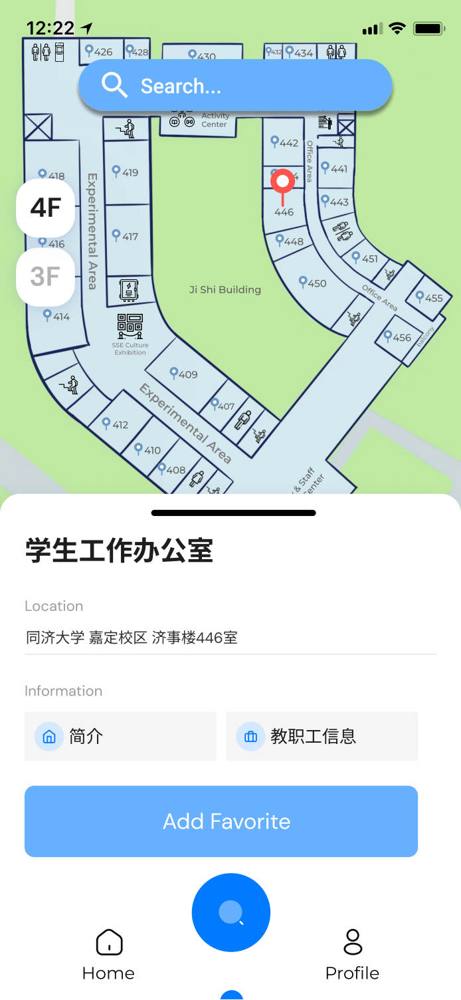
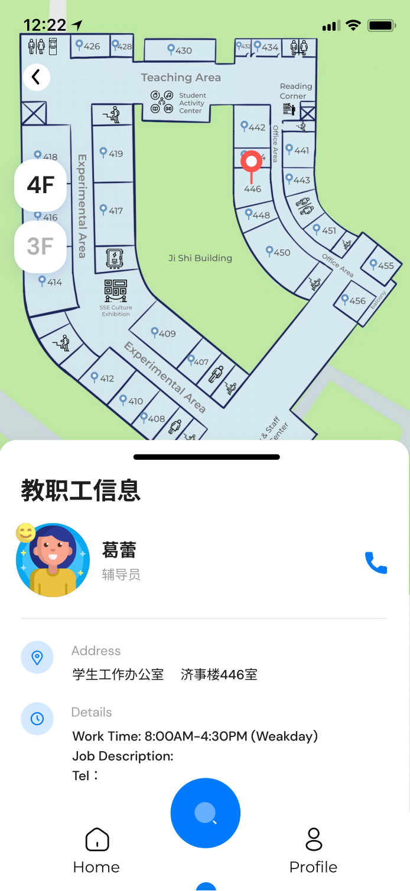
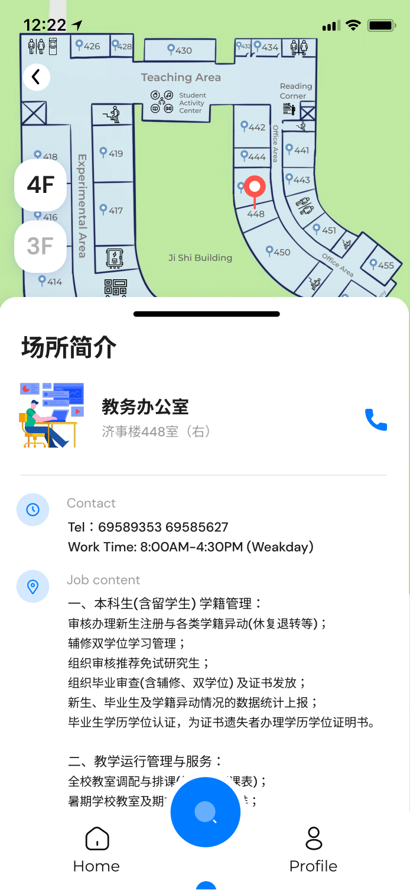
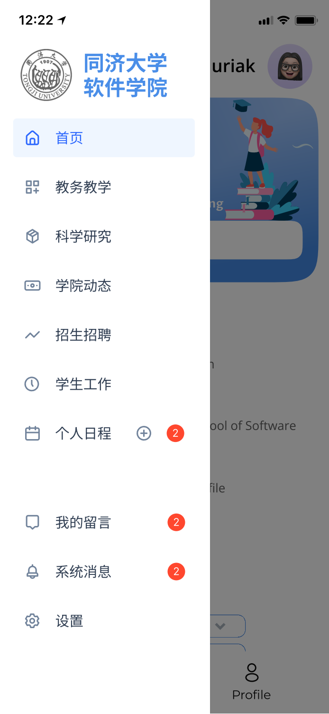
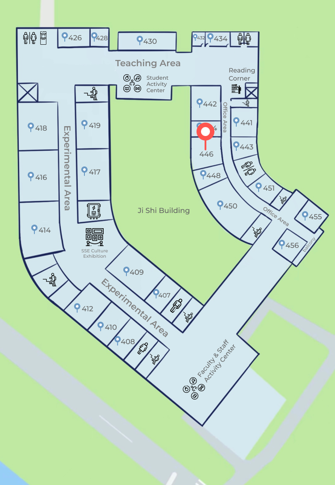

# See-SSE——Fluid Navigation Application

By 2152354 Kairui Zhang

## 1. App Introduction

This is a mobile app called See-SSE for students of the School of Software of Tongji University, which provides the main functions including the floor guide of the Ji Shi Building and a quick overview of information (college events, college profile, faculty, etc.).

## 2. Floor Guiding Function

### 2.1 Function Introduction

   
    
 
     	

            The floor guide interface will provide an overview of all the rooms in the Ji Shi Building where the School of Software is located. Users can click on the corresponding room on the map in the guide interface, or search for a room by keywords (e.g., search for "Student Work Office" or "Ge Lei", etc.). Once you have found a room, you can click on it to get a brief description of the current location, including the location, function, opening hours, and contact phone number, etc. You can also click on the staff information to view information about the staff in the current room, including working hours, work content, and contact information.
        

    

    
    
          
    
 

### 2.2 UI Interface & Design Principles

After clicking into the floor guide interface, in order to better correspond the room information to each room, so set up markers on the map can be directly clicked by the user, after clicking on the markers you can view the name of each room, location information, brief introduction and information about the faculty and staff working or in charge of management in the room.

<table frame=void>
	<tr>
        <td>

        	
        	 
        	(a)Search Page 1
        

</td>    
     	<td>

    			
    		 
    		(b)Search Page 2
        

</td>
	</tr>
</table>

A black bar above the information block allows you to adjust the ratio of the information bar to the map display on the screen, pulling up to display more information and pulling down to view a larger map.

You can also switch floor plans by clicking on "4F" or "3F" on the left. If you are not sure where the room you need is located on the map, you can also click on the search bar above to search for a room or faculty member by keyword, and the location of the room and its information will be marked on the map.

## 3. Quick Info Function

### 3.1 Function Introduction

On the information quick view page, users can search for the information they need through the search bar or enter a menu bar by clicking the icon in the upper left corner of the screen, selecting the information section they want to query, and entering that section to query the information.

### 3.2 UI Interface & Design Principles

The navigation bar allows users to understand the current information section they are in and guides them to their destination. Therefore the main app interface will also use a series of navigation bars to guide users to find and access the information they need.

Through the option bar at the bottom, users can quickly switch between "Information", "Floor Guide" and "Personal Information". When you switch to the main interface of "Information", you can start searching for relevant information at the top of the main interface, and then slide down to see the "College Overview" in the form of a menu, and click on it to enter the corresponding introduction page.
Then you can slide down to see the faculty introduction. You can select the faculty information you need to search by the drop-down column. The first column allows you to select the faculty member's title (professor, associate professor, lecturer, etc.); the second column allows you to select whether the faculty member is a doctoral or master's degree holder; the third column allows you to select the faculty member's department (e.g. Media Arts and Sciences Department). After selecting, there will be a horizontal sliding display of the faculty member's profile at the bottom, you can click to view the faculty member's information, and you can also click "Favorites" or "Comments" at the bottom to perform related operations.

<table frame=void>
	<tr>
        <td>

        	
        	 
        	(a)Main Page 1
        

</td>    
     	<td>

	<!--第二张图片-->
    			
    		 
    		(b)Main Page 2
        

</td>
	</tr>
</table>

Because of the limited screen space on mobile devices, we have placed a number of options in a sidebar that can be accessed by clicking on the icon in the upper left corner of the screen. Once you click on it, you will see the following page, where you can choose to view other information such as "Academic Affairs", "Scientific Research", and "College News". There are also options for replying to messages and system message alerts at the bottom.

## 4. Design Tools & Reference

UI interface design is mainly done through [figma](https://www.figma.com/community);

The mapping was done by referring to Gaode map and Ji Shi Building real scene, and by procreate software.

